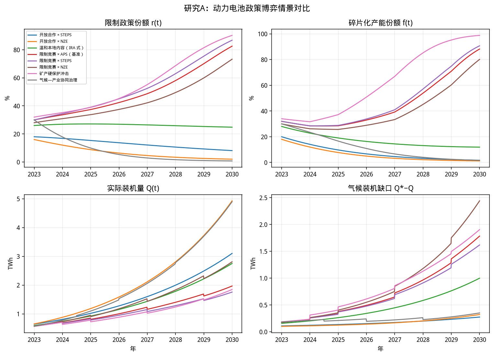
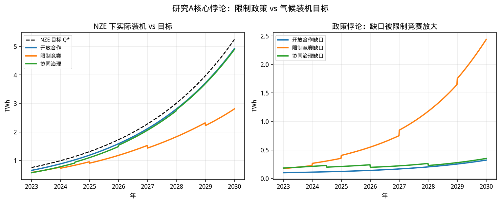
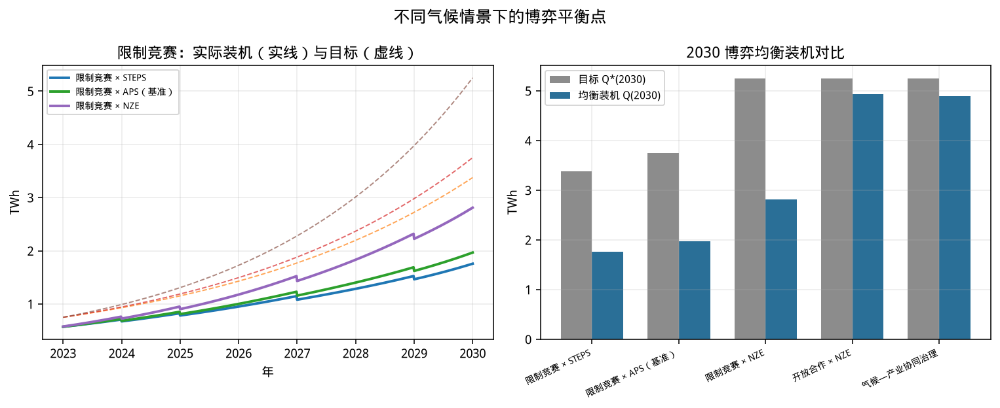
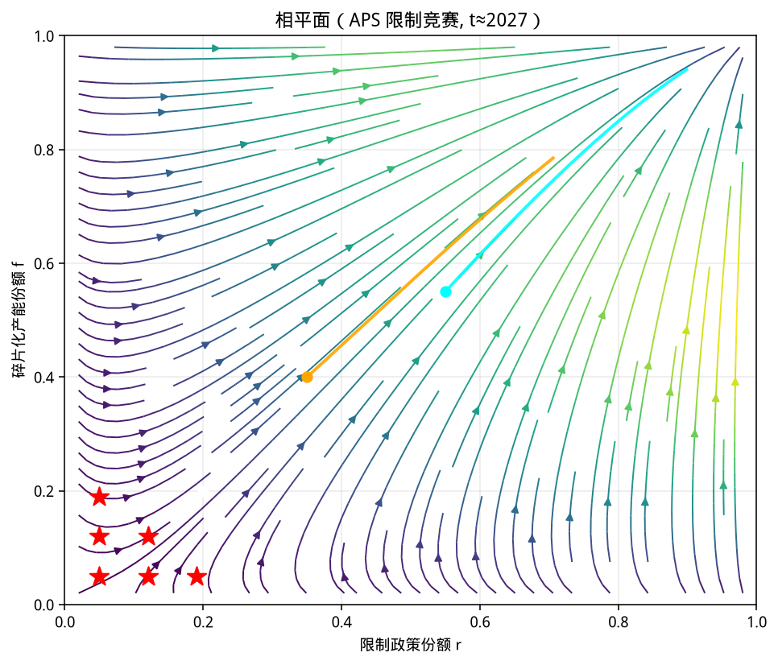
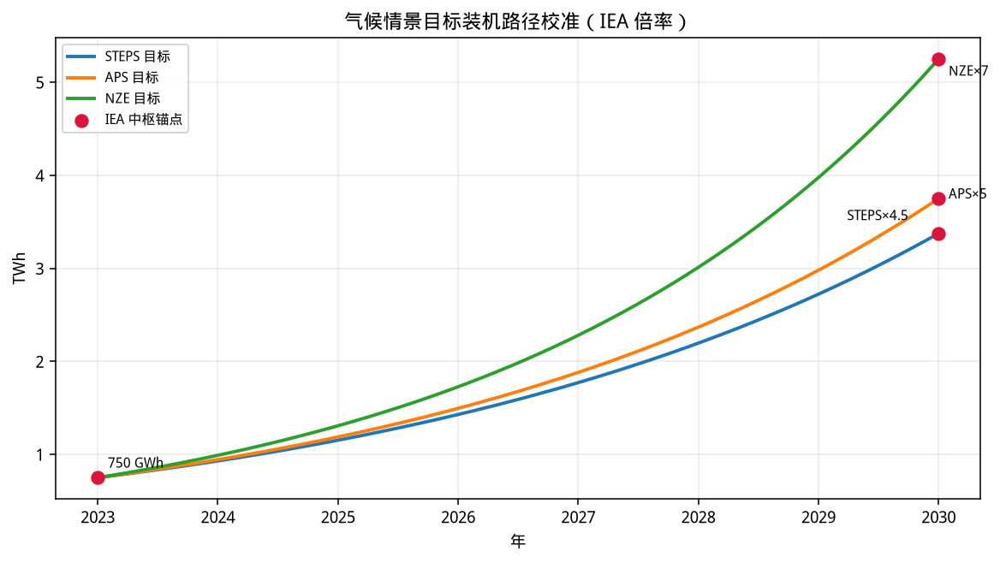

# 研究A：动力电池限制政策与气候装机目标的博弈分析

## 1. 逻辑链论述

在能源转型进程中，动力电池构成电气化路径的核心约束：交通与电力系统脱碳都高度依赖电池装机规模的快速扩张，因而各国竞相发展动力电池产业、提高产量，本意是为能源转型提供物质基础。然而，产量扩张很快转化为对产业链主导权与市场竞争优势的争夺，关税、关键矿产保护、市场准入与本地内容等限制性产业政策随之密集出台；这些工具在一国尺度上可强化本土产能与安全收益，但在全球尺度上会推高成本、分割供应链并压低有效供给。于是出现政策悖论——原本服务于电气化与气候减缓的政策组合，经战略性互动后反而可能削弱全球动力电池产量与装机能力，使实际部署偏离气候变化控制目标所需轨迹。本文据此构建非对称演化博弈模型，刻画主要经济体在「开放合作 / 保护限制」与产业侧「全球一体化 / 碎片化本地化」之间的策略演化，并在 IEA 口径的 STEPS、APS、NZE 等气候情景下求解博弈平衡点，定量回答：各国互动收敛后，全球究竟能实现多少动力电池装机量，以及该均衡装机与各气候情景目标装机之间的缺口有多大。

逻辑链可压缩为五步：

```text
能源转型 → 动力电池成为核心约束
    → 各国扩产以支撑电气化并争夺产业优势
    → 关税 / 矿产保护 / 市场准入等限制政策
    → 供应链碎片化，全球有效产量与装机下降
    → 博弈均衡装机 < 气候情景所需装机（政策悖论）
```

| 环节 | 机制 | 模型映射 |
|------|------|---------|
| 核心约束 | 电气化速度受电池供给约束 | 目标装机 \(Q^*(t;\alpha)\) |
| 扩产竞赛 | 产量扩张与产业租金绑定 | 产业租金、本地化补贴进入支付 |
| 限制政策 | 关税 \(\tau\)、矿产保护 \(\mu\)、准入 \(a\) | 外生工具路径 + 限制份额 \(r\) |
| 产量受损 | 碎片化抬高摩擦、重复建设 | 效率 \(\eta(r,f,\tau,\mu,a)\) |
| 气候偏离 | 实际装机落后于情景目标 | 缺口 \(Q^*-Q\)；气候惩罚仅部分内化 |

---

## 2. 模型结构

### 2.1 两群体非对称演化博弈

| 群体 | 策略 | 状态变量 |
|------|------|---------|
| 主要经济体（政策侧） | 开放合作 \(O\) / 保护限制 \(R\) | \(r=\) 选择限制的份额 |
| 电池产业（产能侧） | 全球一体化 \(G\) / 碎片化本地化 \(F\) | \(f=\) 选择碎片化的份额 |

气候情景强度 \(\alpha\in\{\mathrm{STEPS},\mathrm{APS},\mathrm{NZE}\}\) 同时决定：

1. 目标装机路径 \(Q^*(t;\alpha)\)（以 2023 年约 750 GWh 为基，2030 年分别约 ×4.5 / ×5 / ×7）；
2. 气候欠账进入政策支付的权重。

关键公共品设定：气候收益具有全球公共品属性，各国仅内化份额 \(\phi\)（搭便车）。因此即便处于 NZE，单独开放的激励仍可能不足，限制竞赛可成为演化稳定结果；协同治理情景则把 \(\phi\) 抬高，使开放重新占优。

### 2.2 装机映射

\[
Q(t)=Q^*(t;\alpha)\cdot\eta(r,f,\tau,\mu,a),\qquad
\eta=\frac{1}{1+\text{摩擦}(r,f,\tau,\mu,a)-\text{本地化有限对冲}}
\]

缺口 \(\mathrm{Gap}=Q^*-Q\) 既是气候绩效指标，也反馈进入政策支付。

### 2.3 复制者动力学

\[
\begin{aligned}
\dot r &= \alpha_r\, r(1-r)\,[\pi_R-\pi_O],\\
\dot f &= \alpha_f\, f(1-f)\,[\pi_F-\pi_G].
\end{aligned}
\]

时间单位：年，\(t=0\) 对应 2023，\(t=7\) 对应 2030。

---

## 3. 情景设计

| 情景 ID | 含义 | 叙事角色 |
|--------|------|---------|
| `open_steps` / `open_nze` | 开放合作 × 低/高气候雄心 | 理想对照上界 |
| `mild_ira` | 温和本地内容 | IRA 式中等摩擦 |
| `race_steps` / `race_aps` / `race_nze` | 限制竞赛 × 三气候情景 | **核心：政策悖论** |
| `mineral_hard` | 矿产硬保护冲击 | 放大供给摩擦 |
| `coop_climate` | 气候—产业协同治理 | 提高 \(\phi\)，打破囚徒困境 |

---

## 4. 仿真结果（可复现）

```bash
pip install -r requirements.txt
python -m src.simulate
```

### 4.1 2030 博弈平衡点（装机，TWh）

| 情景 | 目标 \(Q^*\) | 均衡装机 \(Q\) | 缺口 | 限制份额 \(r\) | 碎片化 \(f\) |
|------|-------------:|---------------:|-----:|---------------:|-------------:|
| 开放 × STEPS | 3.38 | 3.10 | 8% | 8% | 2% |
| 开放 × NZE | 5.25 | 4.93 | 6% | 2% | 1% |
| 温和本地内容 | 3.75 | 2.75 | 27% | 25% | 12% |
| 限制竞赛 × STEPS | 3.38 | 1.76 | 48% | 87% | 91% |
| 限制竞赛 × APS | 3.75 | 1.97 | 48% | 83% | 88% |
| 限制竞赛 × NZE | 5.25 | 2.81 | 46% | 73% | 80% |
| 矿产硬保护 | 3.75 | 1.85 | 51% | 90% | 99% |
| 协同治理 × NZE | 5.25 | 4.90 | 7% | 1% | 2% |

### 4.2 政策悖论的定量含义

在 NZE 路径上，限制竞赛相对开放合作：

- 2030 实际装机由约 **4.93 TWh** 降至约 **2.81 TWh**（损失约 **43%**）；
- 气候装机缺口额外扩大约 **2.12 TWh**。

即：气候雄心越高，目标装机越大；若限制竞赛锁定为均衡，绝对缺口反而更大——这正是「助力转型的政策阻碍气候目标」的形式化表达。











---

## 5. 政策含义

1. **产业政策 ≠ 气候政策**：关税、矿产保护与市场准入可提升本国产业租金，但经策略互动后会系统性压低全球有效装机。
2. **NZE 不能自动纠正碎片化**：因气候收益是公共品，搭便车使限制竞赛在高雄心情景下仍可稳定；需要把气候成本显式内化到产业政策规则中。
3. **协同治理的杠杆**：提高气候收益内化份额 \(\phi\)、降低报复性准入壁垒，可使均衡从高 \(r,f\) 转向接近开放路径，装机逼近 \(Q^*\)。
4. **矿产硬保护是高杠杆摩擦**：对上游的突然收紧，会把碎片化推向角点，缺口超过温和本地内容情景。

---

## 6. 模型边界

- 将多国战略互动压缩为两群体演化份额，不识别单一国家最优关税。
- 气候情景目标装机取 IEA 倍率中枢，非完整能源系统联立求解。
- 结论强调**序数关系与数量级**：开放 > 温和限制 > 限制竞赛；NZE 下限制竞赛绝对缺口最大。
- 未内生技术路线（钠电、固态）突破；可类比为外生降低摩擦的反事实。

---

## 7. 一句话结论

动力电池限制政策在国家竞争逻辑下容易演化为碎片化均衡，使全球实际装机系统性低于气候情景所需水平；不同气候情景改变的是目标高度与缺口规模，而不自动消解这一博弈困境。
