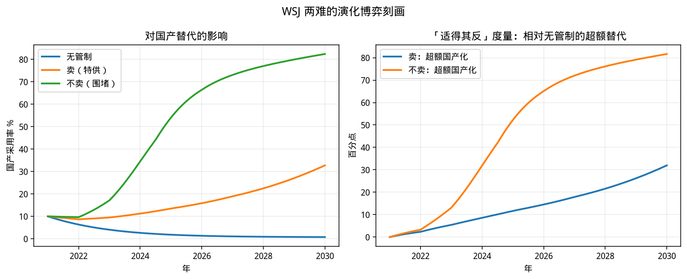
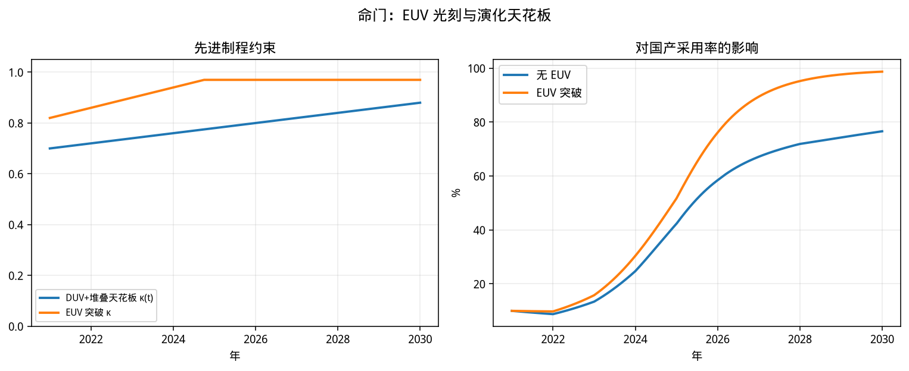

"""
国产芯片 vs 英伟达：演化博弈研究报告
====================================

> 核心命题：美国对华 AI 芯片出口管制，不是静态的「卡脖子」最优化，
> 而是一场改变双方策略收益、触发路径依赖与内点/角点均衡切换的演化博弈。

## 1. 问题意识：WSJ 两难的形式化

公开讨论（含 WSJ 深度报道脉络）把政策两难写得很清楚：

| 美方选择 | 短期效果 | 长期演化后果 |
|---------|---------|-------------|
| **卖**（特供 H20 等） | 中国大模型厂商缓解算力瓶颈，继续吃掉 A/O 以外最大 Token 市场 | 国产替代激励不足，英伟达生态粘性得以延续 |
| **不卖**（高强度围堵） | 暂时压制前沿训练算力 | 把华为等「逼到墙角」，加速国产栈学习与采用，削弱管制「铁拳」的长期权威 |

公开口径锚点（不同机构略有出入，本模型取主流中枢）：

- 2021 年中国 AI 芯片国产替代率约 **10%**
- 2025 年约 **41%**（IDC 口径下英伟达仍约 55%）
- 2030 年预期约 **75%** 左右

转折叙事与模型冲击一一对应：

1. **供给跃迁**：昇腾 950 / 平头哥等自研报告改善国产支付；
2. **信任冲击**：「第4好芯片」类表态与特供反复，抬高英伟达供应风险项；
3. **命门约束**：无 EUV 时 DUV+堆叠抬升缓慢，形成国产化软天花板。

---

## 2. 模型结构

### 2.1 两群体非对称演化博弈

| 群体 | 策略 | 状态变量 |
|------|------|---------|
| 中国 AI 厂商（需求侧） | 国产栈 \(D\) / 英伟达栈 \(N\) | \(x=\) 选国产比例 |
| 国产芯片供给侧 | 高强度投入 \(H\) / 低强度投入 \(L\) | \(y=\) 选 \(H\) 比例 |

美方出口管制强度 \(\sigma(t)\in[0,1]\) 为**外生政策路径**（情景变量）。

先进制程约束用有效天花板 \(\kappa(t)\) 表示：

- 无 EUV：\(\kappa(t)=\min(\kappa_0+\gamma t,\,0.88)\)（DUV+堆叠）
- 有 EUV：\(\kappa\) 迅速接近 \(0.97\)（反事实「秦始皇摸电门」）

### 2.2 支付的经济含义

**需求侧**

- 国产：基准可用性能 + 研发投入增益 + 安装基数网络效应 + 政策补贴 + **管制迫使迁移** − 迁移摩擦 − **相对 \(\kappa\) 的产能拥挤**
- 英伟达：单卡性能优势 + CUDA 锁定 − **供应风险 \(\sigma\)** + **无 EUV 时的前沿训练残留利基**

关键设计（决定定性结论）：

1. **被迫迁移项随 \(x\) 衰减**：管制是早期点火器，不是永久补贴；
2. **拥挤成本 \(\propto (x/\kappa)^3\)**：无 EUV 时出现**内点 ESS**（约 75%），而非角点 100%；
3. **墙角激励**：\(\sigma\) 进入供给侧高强度投入的超额收益（对应华为高管那句话）。

**供给侧**

\[
\pi_H-\pi_L \;\uparrow\; \text{with } (x,\sigma,\kappa,y)
\]

管制越紧、需求侧越转向国产，高强度研发越有演化优势 → **自我强化**。

### 2.3 复制者动力学

\[
\begin{aligned}
\dot x &= \alpha\, x(1-x)\,[\pi_D-\pi_N],\\
\dot y &= \beta\, y(1-y)\,[\pi_H-\pi_L],
\end{aligned}
\]

并加入少量探索噪声，避免策略份额被角点完全吸收。

时间单位：年，\(t=0\) 对应 2021，\(t=9\) 对应 2030。

---

## 3. 情景设计

| 情景 ID | 含义 | 政策叙事 |
|--------|------|---------|
| `no_control` | 无出口管制 | CUDA 锁定主导，国产难以起势 |
| `sell_soft` | 卖：持续特供 | 缓解算力瓶颈，替代激励偏弱 |
| `wsj_dilemma` | **基准：WSJ 两难路径** | 高端收紧 + 特供反复/信任冲击 |
| `hard_ban` | 不卖：高强度围堵 | 最大化墙角激励与迁移推力 |
| `ascend_shock` | 昇腾/平头哥性能冲击 | 打破「不可替代」认知 |
| `euv_breakthrough` | 反事实 EUV 突破 | 撤掉软天花板 |

---

## 4. 仿真结果（可复现）

运行：

```bash
python -m src.simulate
```

### 4.1 基准校准

`wsj_dilemma` 对公开锚点的拟合（见 `output/summary.json`）：

| 年份 | 目标 | 模型 |
|------|------|------|
| 2021 | 10% | 10%（初值） |
| 2025 | 41% | ≈42% |
| 2030 | 75% | ≈77% |

主要情景 2030 国产采用率（仿真）：

| 情景 | 2025 | 2030 |
|------|------|------|
| 无管制 | ≈2% | ≈1% |
| 卖（特供） | ≈14% | ≈33% |
| WSJ 两难（基准） | ≈42% | ≈77% |
| 不卖（围堵） | ≈54% | ≈82% |
| 昇腾冲击 | ≈53% | ≈83% |
| EUV 突破 | ≈52% | ≈99% |


### 4.2 卖 vs 不卖：两难的量化



定性结论与 WSJ 叙事同构：

- **卖**：国产采用上升缓慢，英伟达生态粘性得以延续；中国大模型侧则继续获得「够用」的算力输入（模型外的 Token 市场扩张渠道仍在）。
- **不卖**：国产采用率显著更快逼近 \(\kappa\) 约束下的高位 ESS；管制的短期压制力被长期产业能力抬升所侵蚀——这就是「适得其反」的演化含义。

### 4.3 全情景轨迹


解读要点：

1. **无管制**下国产份额难以起势 → 与「不是被逼到墙角，不会有如此成就」一致；
2. **基准两难路径**穿过 40%→75% 走廊；
3. **昇腾冲击**使拐点提前、稳态更高；
4. **EUV 突破**使拥挤项塌缩，轨迹冲向接近完全国产化的角点附近。

### 4.4 相平面


高 \(\sigma\) 下向量场把状态推向「高 \(x\) + 高 \(y\)」区域；若无 \(\kappa\) 拥挤，将滑向角点；有 \(\kappa\) 则停在内点带状区域。

### 4.5 EUV 命门



没有 EUV，国产替代可以很高，但不是无限：模型把「海阔天空」写成 \(\kappa\) 跃迁后 ESS 的结构性上移。

---

## 5. 策略含义

### 对美方 / 出口管制

- 这是**动态激励设计**问题，不是静态禁运最优。
- 「卖一点阉割版」若伴随政策反复与信任坍塌，可能**两头不讨好**：既没锁死中国算力，又强化了国产投入的期权价值。
- 真正制约全面替代的，是**先进制程与设备联盟**（\(\kappa\)），不是 GPU 销售开关本身。

### 对英伟达

- 中国市场的演化稳定份额，取决于 \(\sigma\) 与 \(\kappa\)，不完全取决于产品性能。
- 特供策略的演化风险：一旦客户完成工具链迁移，网络效应会**不可逆**地从 CUDA 转向国产栈。

### 对国产芯片与 AI 厂商

- 早期支付劣势可以被管制冲击与性能跃迁扭转；过了临界安装基数，复制者动力学会自我加速。
- 中期竞争从「单卡对标」转向「集群+软件栈+可获得性」。
- 长期胜负手仍是 EUV/先进制造：否则 ESS 卡在 70%–85% 内点，前沿训练残留留给外部分或走私/迂回供应。

---

## 6. 模型边界

1. \(\sigma(t)\) 外生，未把美方建成第三演化群体（可扩展为三群体博弈）。
2. 未显式建模 Token 市场价格战与电力/数据中心约束。
3. 参数为结构校准，非计量识别；情景比较的**排序**比绝对百分点更稳健。
4. 「英伟达」在此是 CUDA 生态+可获得算力的代理，不细拆黄仁勋与美国商务部的委托代理摩擦。

---

## 7. 一句话结论

出口管制改变的是演化博弈的**支付景观**：它短期惩罚中国的英伟达依赖，却同时点燃国产供给侧的高强度投入与需求侧的网络迁移；若先进光刻天花板不破，系统收敛到「高国产化但非完全替代」的内点均衡——这正是「铁拳」与「墙角」同时成立的地方。
"""
